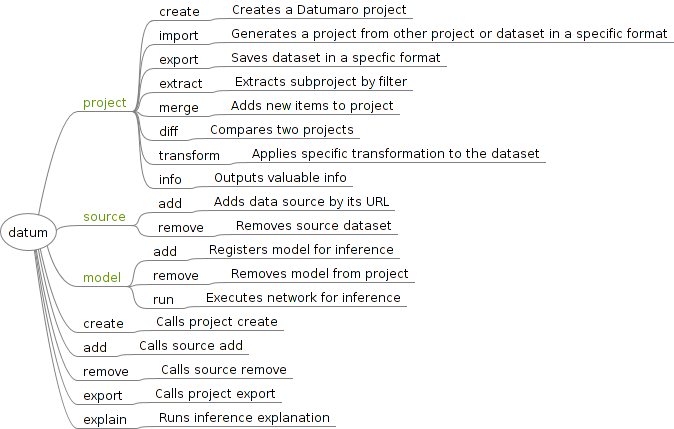

## Table of Contents

- [Installation](#installation)
- [Usage](#usage)
- [Testing](#testing)
- [Design](#design-and-code-structure)

## Installation

### Prerequisites

- Python (3.5+)
- OpenVINO (optional)

``` bash
git clone https://github.com/opencv/cvat
```

Optionally, install a virtual environment:

``` bash
python -m pip install virtualenv
python -m virtualenv venv
. venv/bin/activate
```

Then install all dependencies:

``` bash
while read -r p; do pip install $p; done < requirements.txt
```

If you're working inside CVAT environment:
``` bash
. .env/bin/activate
while read -r p; do pip install $p; done < datumaro/requirements.txt
```

## Usage

> The directory containing Datumaro should be in the `PYTHONPATH`
> environment variable or `cvat/datumaro/` should be the current directory.

``` bash
datum --help
python -m datumaro --help
python datumaro/ --help
python datum.py --help
```

``` python
import datumaro
```

## Testing

It is expected that all Datumaro functionality is covered and checked by
unit tests. Tests are placed in `tests/` directory.

To run tests use:

``` bash
python -m unittest discover -s tests
```

If you're working inside CVAT environment, you can also use:

``` bash
python manage.py test datumaro/
```

## Design and code structure

- [Design document](docs/design.md)

### Command-line

Use [Docker](https://www.docker.com/) as an example. Basically,
the interface is divided on contexts and single commands.
Contexts are semantically grouped commands,
related to a single topic or target. Single commands are handy shorter
alternatives for the most used commands and also special commands,
which are hard to be put into any specific context.



- The diagram above was created with [FreeMind](http://freemind.sourceforge.net/wiki/index.php/Main_Page)

Model-View-ViewModel (MVVM) UI pattern is used.


### Datumaro project and environment structure

<!--lint disable fenced-code-flag-->
```
├── [datumaro module]
└── [project folder]
    ├── .datumaro/
    |   ├── config.yml
    │   ├── .git/
    │   ├── importers/
    │   │   ├── custom_format_importer1.py
    │   │   └── ...
    │   ├── statistics/
    │   │   ├── custom_statistic1.py
    │   │   └── ...
    │   ├── visualizers/
    │   │   ├── custom_visualizer1.py
    │   │   └── ...
    │   └── extractors/
    │       ├── custom_extractor1.py
    │       └── ...
    ├── dataset/
    └── sources/
        ├── source1
        └── ...
```
<!--lint enable fenced-code-flag-->
